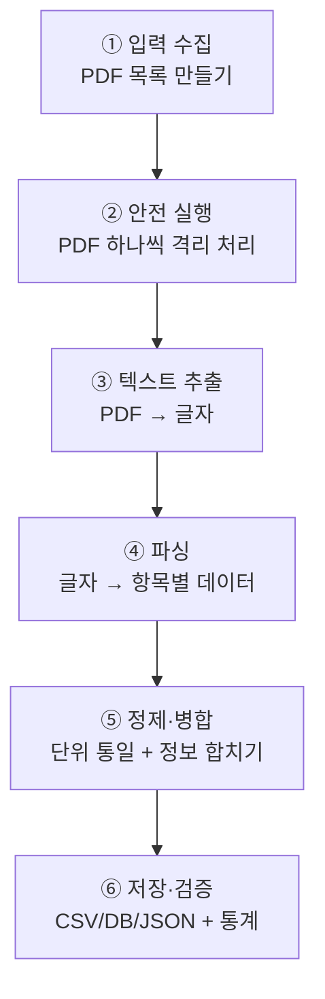

# KFIA 소비기한 PDF 데이터 추출 개발 보고서

| 항목 | 내용 |
|---|---|
| **문서 제목** | KFIA 소비기한 PDF 파싱 · 데이터 추출/정제 흐름 보고서 |
| **대상 프로그램** | `parser/kfia_shelf_life_parser.py` |
| **한 줄 요약** | 정부/협회가 배포한 PDF 보고서에서 식품별 "소비기한" 데이터를 자동으로 뽑아 표(CSV)·데이터베이스로 만드는 프로그램 |
| **읽는 순서** | 위에서 아래로 순서대로 읽으면 됩니다. 1~2장은 개념, 3~5장은 동작 방식, 6~8장은 상세/부록입니다. |

> 이 문서는 개발자가 아니어도 이해할 수 있도록 쉬운 설명을 먼저 두고, 기술적인 내용은 그 뒤에 배치했습니다.

---

## 목차

1. [무엇을, 왜 만들었나 (배경과 목적)](#1-무엇을-왜-만들었나-배경과-목적)
2. [먼저 알아둘 용어](#2-먼저-알아둘-용어)
3. [한눈에 보는 입력과 출력](#3-한눈에-보는-입력과-출력)
4. [전체 처리 흐름 (그림)](#4-전체-처리-흐름-그림)
5. [단계별 상세 설명](#5-단계별-상세-설명)
6. [개발 중 마주친 문제와 해결](#6-개발-중-마주친-문제와-해결)
7. [결과와 품질 검증](#7-결과와-품질-검증)
8. [부록](#8-부록)

---

## 1. 무엇을, 왜 만들었나 (배경과 목적)

### 배경
KFIA(한국식품산업협회)는 「식품유형별 소비기한 설정 보고서」를 **PDF 문서** 형태로 배포합니다.
이 PDF에는 수백 개 식품 품목의 소비기한 정보가 들어 있지만, **사람이 눈으로 읽어야 하는 문서**라서 데이터로 활용하기 어렵습니다.

예를 들어 "냉장 보관하는 이 햄 제품의 소비기한은 며칠인가?"를 알려면, 수백 페이지 PDF를 일일이 넘겨봐야 합니다.

### 목적
이 프로그램은 그 PDF들을 자동으로 읽어서,

- 품목별 소비기한 값을 **엑셀에서 열 수 있는 표(CSV)** 로,
- 검색·집계가 쉬운 **데이터베이스(SQLite)** 로,
- 프로그램 간 연동이 쉬운 **JSON** 으로

정리해 줍니다. 사람이 몇 시간 걸릴 일을 **약 2분**만에 처리합니다.

### 결과 예시
| 품목코드 | 식품유형 | 보관방법 | 소비기한(일) |
|---|---|---|---|
| 17-1-1-1 | 식육가공품 | 냉장 | 53 |
| 23-2-2-10 | 즉석식품 | 냉장 | 3.58 |

---

## 2. 먼저 알아둘 용어

| 용어 | 쉬운 설명 |
|---|---|
| **파싱(Parsing)** | 문서에서 원하는 정보를 규칙에 따라 뽑아내는 작업. "문서 해석하기"라고 생각하면 됩니다. |
| **텍스트 추출** | PDF는 겉보기엔 글자지만 내부적으로는 복잡합니다. 여기서 순수한 글자만 뽑아내는 과정. |
| **정규식(Regex)** | "숫자 뒤에 '일'이 오는 부분을 찾아라" 같은 **패턴 검색 규칙**. 원하는 형태의 글자를 골라냅니다. |
| **품목코드** | 각 식품을 구분하는 고유 번호 (예: `17-1-1-1`). 이 프로그램의 **기준 키** 역할. |
| **레코드(Record)** | 한 품목에 대한 정보 한 줄(엑셀의 한 행에 해당). |
| **CSV** | 쉼표로 구분된 표 파일. 엑셀에서 바로 열립니다. |
| **SQLite** | 파일 하나로 된 가벼운 데이터베이스. 검색·집계에 유리. |
| **JSON** | 프로그램끼리 데이터를 주고받을 때 쓰는 구조화된 텍스트 형식. |
| **프로세스(Process)** | 실행 중인 프로그램의 한 단위. 이 프로그램은 PDF 하나를 별도 프로세스에서 처리합니다(뒤에서 설명). |

---

## 3. 한눈에 보는 입력과 출력

```
[입력]                    [프로그램]                     [출력]
                     ┌────────────────────┐
 PDF 파일 여러 개  →  │ kfia_shelf_life_    │  →  ① CSV  (엑셀용 표)
 (raw 폴더)          │      parser.py      │      ② SQLite (데이터베이스)
                     └────────────────────┘      ③ JSON (연동용)
                                                 + 처리 결과 요약 통계
```

**실행 명령 한 줄:**
```bash
python parser/kfia_shelf_life_parser.py raw -o output/shelf_life_output.csv --db output/shelf_life.db --json output/shelf_life.json
```
- `raw` : PDF들이 들어 있는 폴더
- `-o` : 만들어질 CSV 파일 이름
- `--db` / `--json` : 데이터베이스/JSON 도 함께 생성

---

## 4. 전체 처리 흐름 (그림)

프로그램은 크게 **6단계**로 동작합니다.



| 단계 | 하는 일 | 비유 |
|---|---|---|
| ① 입력 수집 | 처리할 PDF 목록 작성 | 읽을 책들을 책상에 쌓기 |
| ② 안전 실행 | PDF를 하나씩 안전하게 처리 | 책 한 권씩, 시간 제한 두고 읽기 |
| ③ 텍스트 추출 | PDF에서 글자만 뽑기 | 책을 소리 내어 텍스트로 옮기기 |
| ④ 파싱 | 글자에서 필요한 값 찾기 | 형광펜으로 중요한 숫자 표시 |
| ⑤ 정제·병합 | 단위 통일, 흩어진 정보 합치기 | 표시한 내용을 정리 노트로 |
| ⑥ 저장·검증 | 파일로 저장하고 점검 | 노트를 제출하고 검토 |

---

## 5. 단계별 상세 설명

### 핵심 개념: 한 품목의 정보는 두 페이지에 나뉘어 있다

KFIA 보고서에서 **한 품목의 정보는 두 종류의 페이지에 흩어져** 있습니다.
프로그램은 이 둘을 **품목코드**로 연결(조인)해 하나로 합칩니다.

| 페이지 종류 | 이 페이지임을 아는 방법(키워드) | 담당 함수 | 여기서 얻는 정보 |
|---|---|---|---|
| **제품 기본정보** | `식품유형` + `보존 및 유통온도` | `parse_product_page()` | 식품유형, 성상, 포장방법, 기존 유통기한, 보존/유통온도 |
| **소비기한 결론** | `소비기한 참고값 설정` | `parse_shelf_life_page()` | 보관방법, 기준온도, 품질안전한계기간, 안전계수, **소비기한 참고값**, 온도별 상세표 |

---

### 단계 ① 입력 수집 — `collect_pdfs()`
- 파일 하나든 폴더든 받아서, 처리할 PDF 목록을 만듭니다. 폴더는 하위까지 모두 뒤집니다.
- 존재하지 않는 경로는 경고만 남기고 넘어갑니다.

### 단계 ② 안전 실행 — `process_pdf()`
PDF 하나하나를 **별도의 프로세스**에서 처리합니다. 이렇게 하는 이유는 두 가지입니다.

1. **멈춤 방지**: 어떤 PDF는 처리가 비정상적으로 오래 걸릴 수 있습니다. 제한 시간(`--timeout`, 기본 120초)을 넘기면 **그 파일만 건너뛰고** 나머지는 계속 진행합니다. → 하나 때문에 전체가 멈추지 않습니다.
2. **멈춤(데드락) 회피**: 처리 결과를 프로세스 간에 주고받을 때 데이터가 크면 서로 기다리다 멈추는 현상이 생길 수 있습니다. 이를 피하려고 **결과를 먼저 받아온 뒤** 프로세스를 정리합니다. (자세한 내용은 [6장](#6-개발-중-마주친-문제와-해결) 참고)

### 단계 ③ 텍스트 추출 — `_parse_pdf_worker()`
- PyMuPDF(`fitz`) 라이브러리로 PDF를 열고, 페이지를 1쪽부터 순서대로 넘기며 **글자(텍스트)** 를 뽑습니다.
- 특정 페이지에서 오류가 나도 그 페이지만 건너뛰고 계속합니다.
- 각 페이지 글자를 위의 두 파서(④)에 넘겨 품목코드별로 정보를 모읍니다.

### 단계 ④ 파싱 (글자 → 데이터)

#### 4-a. 제품 기본정보 — `parse_product_page()`
- 페이지에 `식품유형`과 `보존 및 유통온도`가 **둘 다** 있어야 이 페이지로 인식합니다.
- 품목코드와 각 항목(식품유형, 성상 등)을 정규식으로 찾아냅니다.

#### 4-b. 소비기한 결론 — `parse_shelf_life_page()`
- `소비기한 참고값 설정`이라는 문구가 있어야 이 페이지로 인식합니다.
- **문장에서 핵심 값**을 찾습니다. 예: "품질안전한계기간은 **70일**", "안전계수 **0.77**", "소비기한 참고값은 **53일**".
- **온도별 상세표**도 읽습니다. 표의 숫자들이 줄바꿈으로 흩어져 있어, 온도 표시(`10℃` 등)를 기준점으로 삼아 각 온도 구간의 값을 짝지어 추출합니다.

### 단계 ⑤ 정제 · 병합

#### 5-a. 단위 통일 — `to_days()`
보고서는 품목에 따라 소비기한을 **"일"** 또는 **"시간"** 으로 적습니다(예: 즉석식품류는 시간 단위).
서로 비교가 가능하도록 **모두 "일" 단위로 통일**합니다.

- 예: `49시간` → `2.04일` (49 ÷ 24)
- 대신 원래 단위(`일`/`시간`)는 별도의 `단위` 칸에 남겨, 변환 여부를 확인할 수 있게 합니다.

> 이렇게 하면 "일 단위"인 `소비기한참고값_일` 칸만 보고도 모든 품목을 공정하게 비교할 수 있습니다.

#### 5-b. 정보 합치기
- 같은 품목코드의 "기본정보"와 "소비기한 결론"을 하나의 레코드로 합칩니다.
- 어느 PDF의 몇 페이지에서 나왔는지(`source_pdf`, `source_page`), 언제 뽑았는지(`추출일시`)도 함께 기록합니다.

### 단계 ⑥ 저장 · 검증

| 저장 형식 | 함수 | 특징 |
|---|---|---|
| CSV | `save_csv()` | 엑셀에서 한글이 깨지지 않도록 `utf-8-sig`로 저장 |
| SQLite | `save_sqlite()` | 같은 품목 중복 저장 방지, 재실행해도 안전 |
| JSON | (본문) | 전체 데이터를 그대로 저장 |

마지막으로 `print_summary()`가 **처리 결과 요약**을 보여줍니다.
- 총 몇 건 추출했는지, 식품유형별/보관방법별 개수
- 소비기한 최소·최대·평균
- **값이 빠진 품목**과 **온도별 표 파싱 성공률** → 데이터 품질을 바로 점검

---

## 6. 개발 중 마주친 문제와 해결

이 프로그램은 실제로 돌려보며 두 가지 중요한 문제를 발견하고 고쳤습니다.

### 문제 1. 일부 PDF가 통째로 누락됨 (처리 멈춤/데드락)
- **증상**: 페이지가 많은 PDF(수백 쪽)가 60초 제한에 걸려 자꾸 건너뛰어졌습니다. 처리 시간도 13분이나 걸렸습니다.
- **원인**: 실제 계산은 12초면 끝나는데, 프로세스끼리 결과를 주고받는 과정에서 **서로 기다리다 멈추는 현상(데드락)** 이었습니다. 데이터가 크면 발생합니다.
- **해결**: 결과를 **먼저 받아온 뒤** 프로세스를 정리하도록 순서를 바꿨습니다.
- **효과**: 처리 시간 **13분 → 약 2분**, 누락 **0건**, 추출 건수 **392건 → 963건**.

### 문제 2. "시간" 단위 소비기한을 못 읽음
- **증상**: 즉석식품류 등 51개 품목의 소비기한 값이 비어 있었습니다.
- **원인**: 이 품목들은 소비기한이 **"시간"** 단위인데, 프로그램은 **"일"** 단위만 찾고 있었습니다.
- **해결**: "일"과 "시간"을 모두 인식하도록 규칙을 확장하고, 값을 일 단위로 환산(`to_days`)하며, 원래 단위를 `단위` 칸에 보존했습니다.
- **효과**: 누락 **51건 → 0건**, 모든 품목의 소비기한 값 확보.

---

## 7. 결과와 품질 검증

최종 실행 결과(예시):

| 지표 | 값 |
|---|---|
| 처리한 PDF | 45개 |
| 총 추출 레코드 | 963건 |
| 시간 단위(→일 환산) 품목 | 51건 |
| 소비기한 값 누락 | 0건 |
| 온도별 상세표 파싱 성공 | 962 / 963건 |
| 총 처리 시간 | 약 2분 |

> 온도별 상세표 1건은 표 형식이 완전히 다른 예외 케이스로, 요약 값은 정상 추출되었습니다.

---

## 8. 부록

### 8-1. 출력 데이터 항목(컬럼) 전체

| 컬럼 | 타입 | 출처 | 설명 |
|---|---|---|---|
| `품목코드` | TEXT | 공통 | 품목 고유번호, 조인 기준 (예: `17-1-1-1`) |
| `식품유형` | TEXT | 기본정보 | 식품 분류 |
| `성상` | TEXT | 기본정보 | 형태/상태 |
| `포장방법` | TEXT | 기본정보 | |
| `기존유통기한` | TEXT | 기본정보 | 기존 표기값 |
| `보존유통온도` | TEXT | 기본정보 | |
| `보관방법` | TEXT | 결론 | 냉장/냉동/실온 |
| `기준온도` | TEXT | 결론 | 예: `10℃` |
| `품질안전한계기간_일` | REAL | 결론 | 일 단위 통일 |
| `안전계수` | REAL | 결론 | 안전을 위한 곱하는 계수 |
| `소비기한참고값_일` | REAL | 결론 | **핵심 값**, 일 단위 통일 |
| `단위` | TEXT | 결론 | 원본 단위(`일`/`시간`) |
| `온도별_상세_json` | TEXT | 결론 | 온도별 값 배열(JSON) |
| `source_pdf` | TEXT | 메타 | 원본 PDF 파일명 |
| `source_page` | INTEGER | 메타 | 원본 페이지 번호 |
| `추출일시` | TEXT | 메타 | 프로그램이 뽑아낸 시각 |

`온도별_상세_json` 한 항목의 구조:
```json
{
  "온도": "10℃",
  "보관방법": "냉장",
  "품질안전한계기간": 70,
  "안전계수": 0.77,
  "소비기한참고값": 53,
  "단위": "일"
}
```

### 8-2. 함수 호출 계층

```
main()                              프로그램 시작점
├── collect_pdfs()                  ① 입력 → PDF 목록
└── PDF마다 반복:
    └── process_pdf(timeout)        ② 안전 실행(격리+시간제한)
        └── _parse_pdf_worker()     (별도 프로세스에서 실행)
            ├── fitz.open / get_text   ③ 텍스트 추출
            ├── parse_product_page()   ④-a 기본정보 파싱
            │   └── extract_field()
            └── parse_shelf_life_page()④-b 소비기한 파싱
                └── to_days()          ⑤ 단위 통일
    (정보 병합 → 전체 레코드)
    ├── print_summary()             ⑥ 검증 통계
    ├── save_csv()                  ⑥ CSV 저장
    ├── save_sqlite()               ⑥ DB 저장
    └── (JSON 저장)                 ⑥ JSON 저장
```

### 8-3. 실행 방법

```bash
# 1) 필요한 라이브러리 설치
pip install pymupdf tqdm

# 2) 전체 실행 (raw 폴더의 모든 PDF 처리)
python parser/kfia_shelf_life_parser.py raw \
    -o output/shelf_life_output.csv \
    --db output/shelf_life.db \
    --json output/shelf_life.json

# 3) 처리가 오래 걸리는 PDF가 있으면 제한 시간 늘리기
python parser/kfia_shelf_life_parser.py raw --timeout 300 -o output/out.csv
```

### 8-4. 실행 옵션 정리

| 옵션 | 기본값 | 설명 |
|---|---|---|
| `input` | (필수) | PDF 파일 또는 폴더 (여러 개 가능) |
| `-o, --output` | `shelf_life_output.csv` | CSV 저장 경로 |
| `--db` | 없음 | SQLite 데이터베이스 저장 경로 |
| `--json` | 없음 | JSON 저장 경로 |
| `--no-csv` | 꺼짐 | CSV를 만들지 않음 |
| `--timeout` | `120` | PDF 1개당 최대 처리 시간(초), 넘으면 스킵 |
| `-v, --verbose` | 꺼짐 | 파일별 진행 상황을 자세히 출력 |

### 8-5. 주의사항

- **데이터베이스 스키마를 바꾼 경우**: 기존 `.db` 파일은 자동으로 갱신되지 않습니다. 컬럼 구성이 바뀌면 **기존 `.db` 파일을 삭제한 뒤** 다시 실행해야 합니다.
- **필수 라이브러리**: `pymupdf`가 없으면 실행되지 않습니다. `tqdm`이 없으면 진행 막대만 생략되고 동작은 정상입니다.
- **Windows에서 실행**: `python parser/...` 형태로 실행하세요. (파일 첫 줄의 `#!/usr/bin/env python3`는 Windows에서 직접 쓰지 않습니다.)
